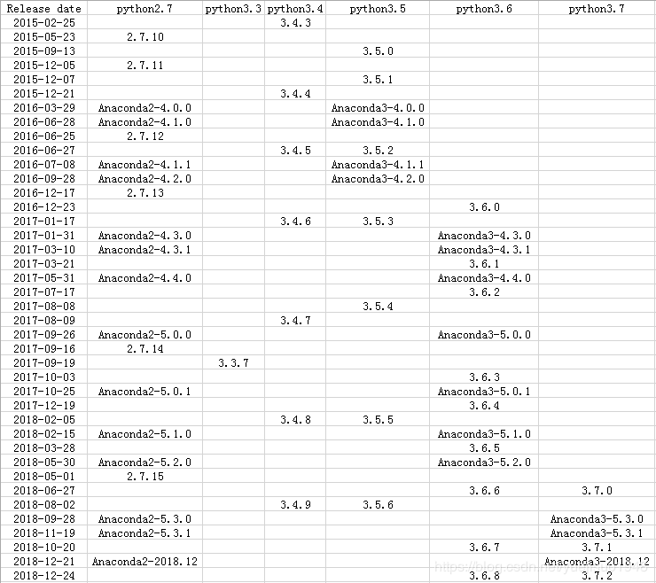

# cuda:9.0-cudnn7-devel-ubuntu16.04 python3 docker 安装 caffe
## 1.安装docker镜像
```shell
sudo docker pull nvidia/cuda:9.0-cudnn7-devel-ubuntu16.04
# 创建一个cuda9.0 cudnn7 ubuntu16.04的容器，名字为caffe，同时将本机的/home/hzh目录挂载到容器的/var/workspace下面
sudo nvidia-docker run -it -v /home/hzh:/var/workspace --name caffe nvidia/cuda:9.0-cudnn7-devel-ubuntu16.04 /bin/bash
```

## 2.配置cuda
```shell
echo 'add for cuda' >> ~/.bashrc
echo 'export PATH="/usr/local/cuda-9.0/bin:$PATH"' >> ~/.bashrc
echo 'export LD_LIBRARY_PATH="/usr/local/cuda-9.0/lib64:$LD_LIBRARY_PATH"' >> ~/.bashrc
source ~/.bashrc
```

## 3.安装anaconda和一些库
anconda对应python版本：

<div align="center">

</div>

### 3.1 安装anaconda
安装Anaconda3-5.1.0-Linux-x86_64.sh，python版本为3.6，不用新建虚拟环境，可以直接安装在/root下，安装时选择将bin目录添加到PATH
另外要把lib也加到LD_LIBRARY_PATH，否则后面runtest可能会报错
```shell
echo 'add for anaconda' >> ~/.bashrc
echo 'export LD_LIBRARY_PATH="/root/anaconda3/lib:$LD_LIBRARY_PATH"' >> ~/.bashrc
source ~/.bashrc
```
### 3.2 安装vim和git
```shell
apt-get update
apt-get install vim
apt-get install git
```

## 4.安装caffe依赖库
### 4.1 boost等库
因为libboost直接用apt安装的话好象是python2.7和3.5的版本，3.6要重新编译再建软连接一堆乱七八糟的，但是后来发现用conda可以直接安装libboost1.67（对应py36），省了不少事
```shell
conda install boost hdf5 snappy leveldb lmdb gflags glog
```
### 4.2 protobuf
protobuf不在`~/anaconda3/include`目录下，而是`~/anaconda3/pkgs/libprotobuf-3.5.2-h6f1eeef_0`，所以需要添加到环境变量中：
```shell
protoc --version
conda install protobuf==3.5.1
echo 'export PATH="/root/anaconda3/pkgs/libprotobuf-3.5.2-h6f1eeef_0/bin:$PATH"' >> ~/.bashrc
echo 'export LD_LIBRARY_PATH="/root/anaconda3/pkgs/libprotobuf-3.5.2-h6f1eeef_0/lib:$LD_LIBRARY_PATH"' >> ~/.bashrc
source ~/.bashrc
protoc --version
```

到[release页面](https://github.com/protocolbuffers/protobuf/releases)下载和protoc（即protobuf-cpp）版本一样的protobuf-python，然后：
```shell
tar -xzvf protobuf-python-3.5.1.tar.gz
cd protobuf-python-3.5.1
cd python
python setup.py build
python setup.py test
python setup.py install
```

这样protobuf python runtime就编译和安装好了

### 4.3 OpenBLAS
```shell
git clone https://github.com/xianyi/OpenBLAS.git
cd OpenBLAS
make FC=gfortran -j $(($(nproc) + 1))
make PREFIX=~/Openblas install # 安装到/root下
echo 'export LD_LIBRARY_PATH="/root/Openblas/lib:$LD_LIBRARY_PATH"' >> ~/.bashrc
source ~/.bashrc
```

### 4.4 OpenCV
```shell
conda install -c menpo opencv3
```
安装之后在python中import cv2会出现问题
```shell
find / -iname "cv2.cpython-36m-x86_64-linux-gnu.so" # 找到这个so文件
cp cv2.cpython-36m-x86_64-linux-gnu.so /root/anaconda3/lib/python3.6
ln -s cv2.cpython-36m-x86_64-linux-gnu.so cv2.so
```

此时import cv2，可能会报"ImportError: libgtk-x11-2.0.so.0: cannot open shared object file"
```shell
apt-get update
apt-get install libgtk2.0-dev
```

之后应该没问题了

## 5.编译caffe
```shell
git clone https://github.com/BVLC/caffe.git
cd caffe
cp Makefile.config.example Makefile.config
vi Makefile.config
```

修改以下地方：
- `USE_CUDNN := 1`前的注释去掉
- `OPENCV_VERSION := 3`前的注释去掉
- 把`-gencode arch=compute_20/21,code=sm_20/21`两行删掉
- 因为安装的是openblas，`BLAS := atlas`改为`BLAS := open`，`BLAS_INCLUDE := /root/Openblas/include`， `BLAS_LIB := /root/Openblas/lib`
- 把`PYTHON_INCLUDE`注掉，解注`ANACONDA_HOME`那几行，同时把3.5改为3.6
- 解注释`PYTHON_LIBRARIES := boost_python36 python3.6m`，这两个文件在~/anaconda3/lib目录下，名为libboost_python36.so和libpython3.6m.so，如果不是这两个名字，相应修改，可能是libboost_python3.so等
- 解注释`PYTHON_LIB := $(ANACONDA_HOME)/lib`
- 解注释`WITH_PYTHON_LAYER := 1`
- LIBRARY_DIRS := $(PYTHON_LIB) /usr/local/lib /usr/lib /usr/lib/x86_64-linux-gnu

**完整的[Makefile.config](./Makefile.config)文件**

```shell
make clean  # 如果之前编译过的话，清除掉
make all -j8
make test -j8
make runtest -j8
make pycaffe -j8
```
如果make时出现错误，找不到lib*，找不到一个依赖，用上面的`find`找到它的位置，再把它的lib所在的位置添加到LD_LIBRARY_PATH

将caffe路径添加到用户环境变量，这样才可以import：
```shell
echo 'export CAFFE_ROOT="/home/caffe"' >> ~/.bashrc
echo 'export PYTHONPATH="/home/caffe/python:$PYTHONPATH"' >> ~/.bashrc
source ~/.bashrc
```
然后打开python，输入import caffe，没有报错就安装成功了

~~不放心的~~还可以跑个mnist：
```sh
cd /home/caffe
sh data/mnist/get_mnist.sh
sh examples/mnist/create_mnist.sh
sh examples/mnist/train_lenet.sh
```

## 6.安装ssd
直接把caffe的Makefile.config复制到ssd的目录下make时会报以下错误：
```
...
.build_release/lib/libcaffe.so: undefined reference to `boost::re_detail::cpp_regex_traits_implementation<char>::transform_primary(char const*, char const*) const'
.build_release/lib/libcaffe.so: undefined reference to `boost::re_detail::cpp_regex_traits_implementation<char>::transform(char const*, char const*) const'
...
```
google查了后大概是高版本的gcc编译时需要c++11的支持，而默认的是不带的，所以需要重新编译与anaconda同版本的boost，再用新编译的lib文件替换原来的文件（不一定是最优的方案，但至少有效...）
```shell
./bootstrap.sh 
./b2 toolset=gcc
./b2 install --with-python include="~/anaconda3/include/python3.6m/"
ldconfig -v
./bootstrap.sh --with-libraries=python --with-toolset=gcc
./b2 cflags='-fPIC' cxxflags='-fPIC' --with-python include="/root/anaconda3/include/python3.6m/"
cp /home/boost-1.67.0/stage/lib/* /root/anaconda3/lib/
```

- 下载weiliu89的caffe并切换到ssd分支
```shell
cd /home && mkdir ssd && cd ssd
git clone https://github.com/weiliu89/caffe.git
cd caffe
git checkout ssd
```

- 编译
```shell
make -j8
# Make sure to include $CAFFE_ROOT/python to your PYTHONPATH.
echo 'export PYTHONPATH="/home/ssd/caffe/python:$PYTHONPATH"' >> ~/.bashrc
make py
make test -j8
```
未报错即为安装成功

## 参考
1. https://zoesxw.github.io/2018/07/14/caffe%E5%AE%89%E8%A3%85/
2. https://blog.csdn.net/u012939880/article/details/82887985
3. https://github.com/BVLC/caffe/issues/6043
4. https://github.com/weiliu89/caffe/tree/ssd
